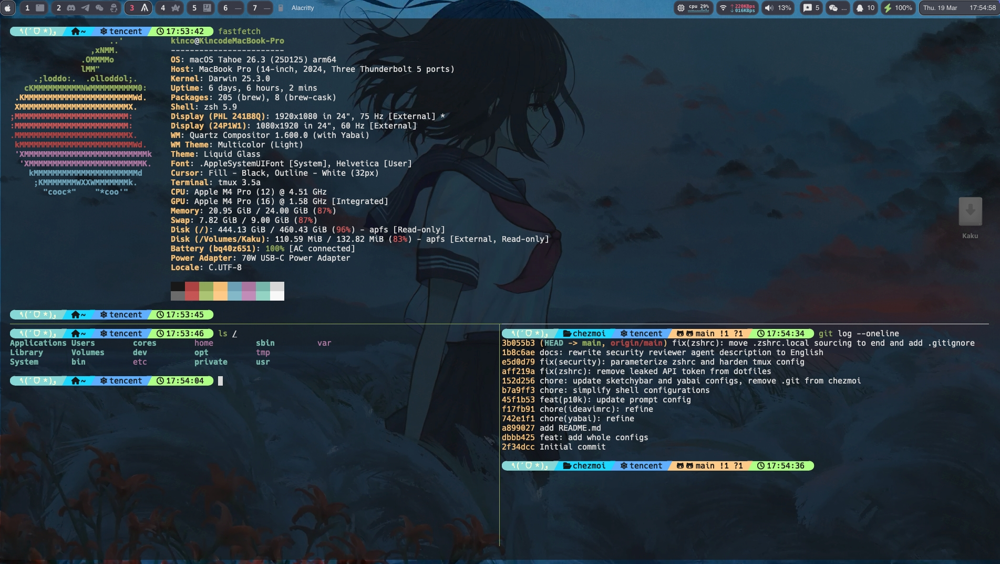
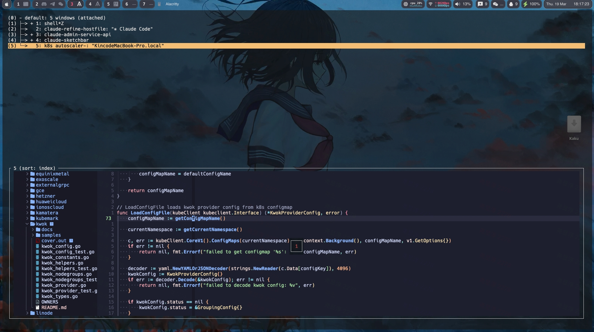
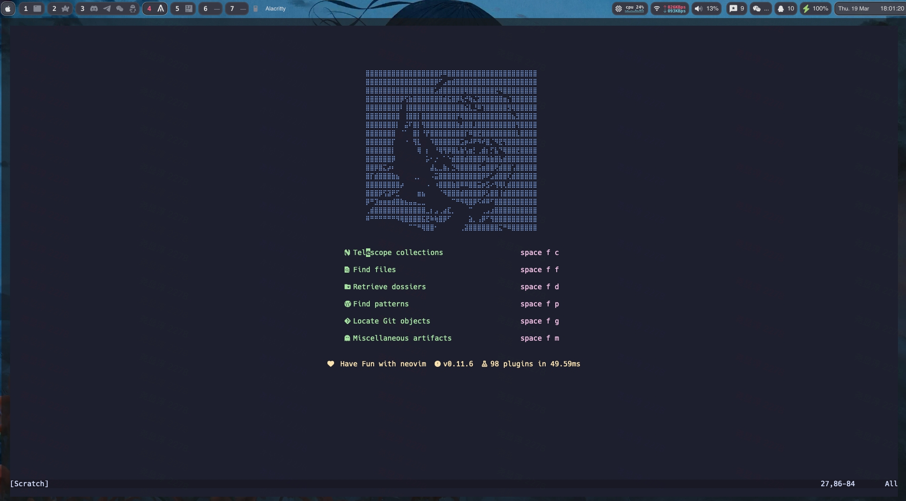
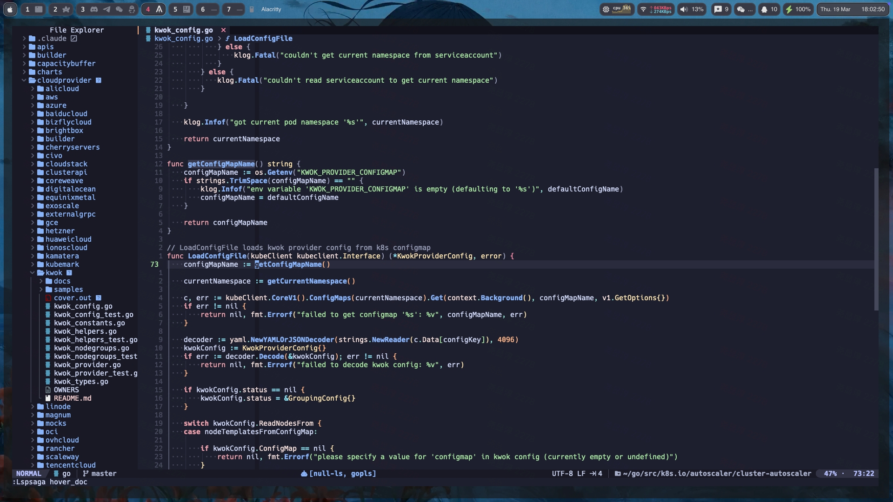
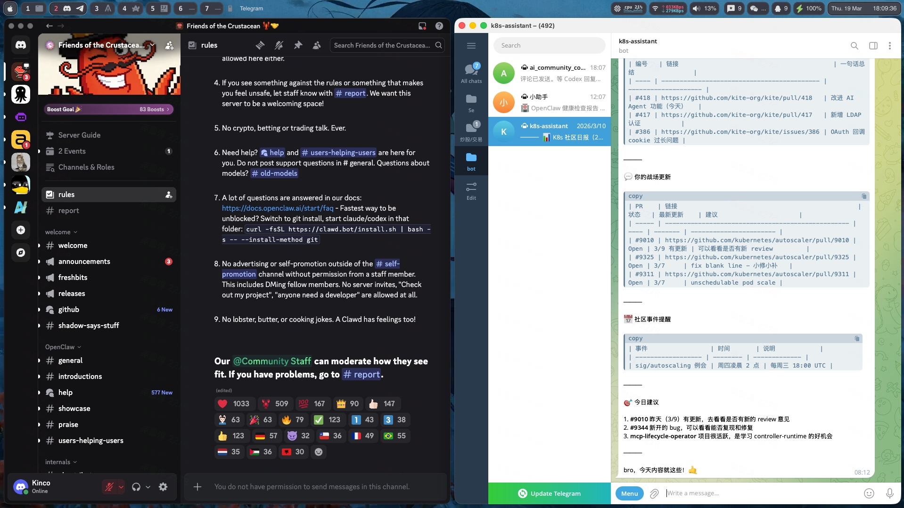
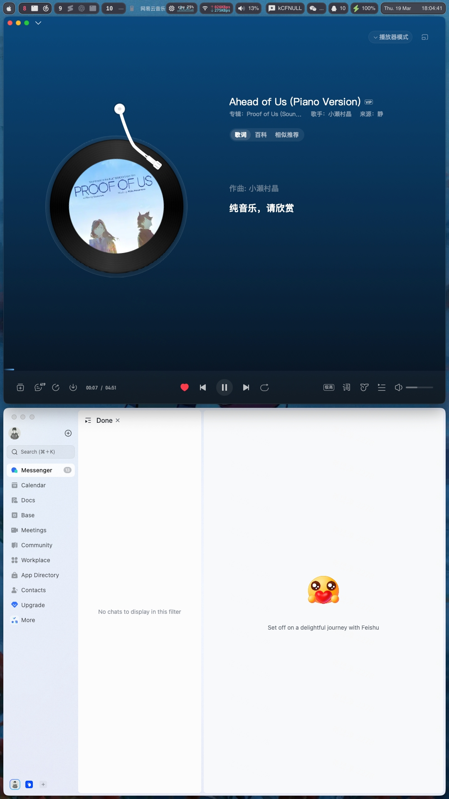

<div align="center">


### macOS Personal Development Environment

[]() []() []() []() []() []() []()

</div>

---

## Terminal / 终端

- **tmux** — Prefix `Ctrl+z`, hjkl pane nav, session persistence via resurrect + continuum. 
- **zsh** — oh-my-zsh + Powerlevel10k + autosuggestions + syntax-highlighting. 
- **Alacritty** — Hack Nerd Font, 70% opacity, borderless.




## Editor / 编辑器

**Neovim** based on [ayamir/nvimdots](https://github.com/ayamir/nvimdots) — nvim-cmp + Copilot, telescope, DAP, catppuccin.




## Window Management / 窗口管理

**yabai** BSP auto-tiling + **skhd** hotkeys + **sketchybar** status bar (C event providers). Dual-monitor deterministic layout, Vim-style focus, dropdown terminal.




## Also includes / 其他

- **JetBrains IDE** — Vim emulation via IdeaVim
- **Tools** — kubectl, Docker, NVM, mise, lazygit, autojump

## Setup

```bash
chezmoi apply       # Apply dotfiles
chezmoi diff        # Preview changes
```

## Credits

- [chezmoi](https://www.chezmoi.io/) 
- [ayamir/nvimdots](https://github.com/ayamir/nvimdots) 
-  [yabai](https://github.com/koekeishiya/yabai) 
-  [skhd](https://github.com/koekeishiya/skhd) 
-  [sketchybar](https://github.com/FelixKratz/SketchyBar) 
-  [powerlevel10k](https://github.com/romkatv/powerlevel10k)
